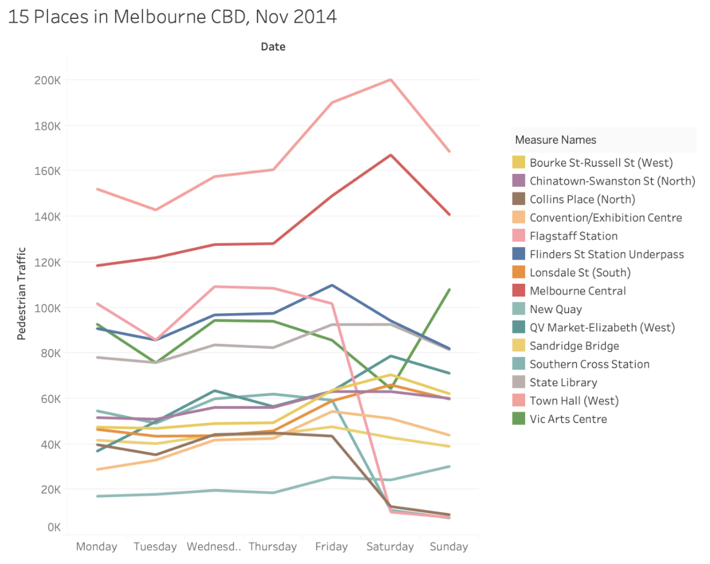
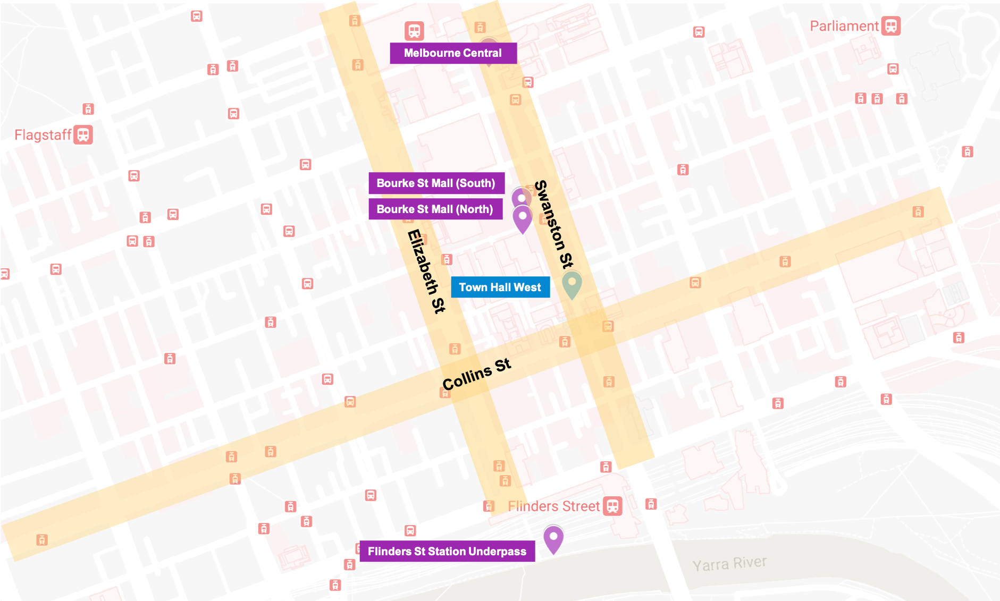
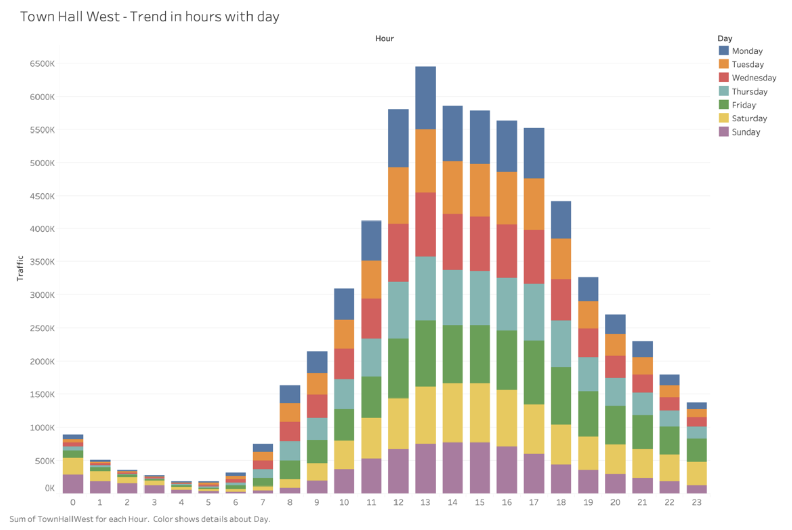
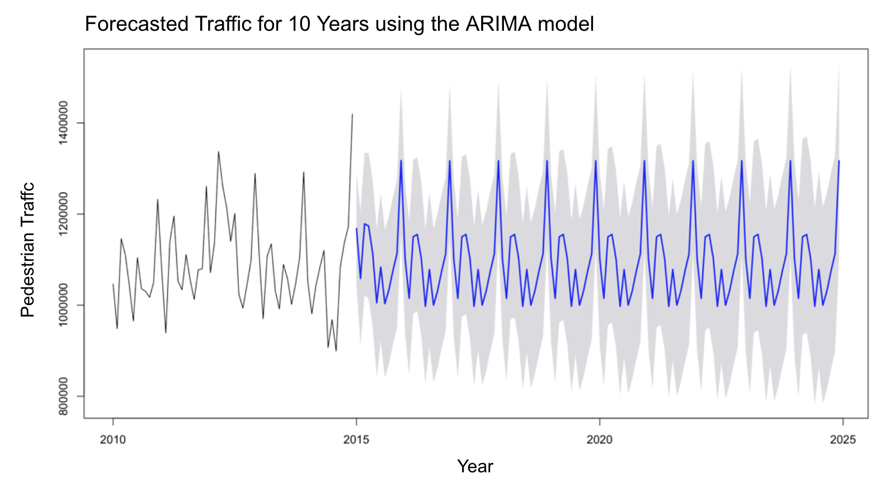

# Data Analysis and Decision Support

### Purpose
The purpose of this project is to implement analyse, visualise, and forecast pedestrian traffic data around the Melbourne CBD to provide a solution for Yarra Trams to provide a better passenger experience and to minimize the overcrowding issue. 

### Tools
- Data storage: MongoDB
- Data analytics and visualisations: Tableau and R

### Version
16 July 2022

### Initial Trial of Data Visualisation
- Tableau was used for initial trial of data visualisation of data for November 2014. Fifteen sensor locations were randomly selected to understand how the data would be presented. Though the data is very limited in its visualisation using Tableau, it can still be inferred that each place had different pedestrian traffic and peak hours. 

&nbsp;&nbsp;&nbsp;&nbsp;&nbsp;&nbsp;&nbsp;

### Interesting Findings
- When looking into overcrowding in the evening peak, it was revealed that trams travelling along Collins Street in the Melbourne CBD were the only services found to breach load standards, averaging around 105%. In fact, the intersection of Collins St and Swanston St is considered to be one of the busiest tram intersections in the world. Moreover, one of the most crowded tram routes, 48, is also on Collins St. 

- Upon analysing pedestrian traffic around the Melbourne CBD, the top five sensor locations having the highest average traffic and the highest traffic flow in total from 2009 to 2014 (excluding 2011) are Town Hall West, Melbourne Central, Bourke Street Mall (South), Bourke Street Mall (North), and Flinders St Station Underpass. 

&nbsp;&nbsp;&nbsp;&nbsp;&nbsp;&nbsp;&nbsp;

- The location which had the highest average and total traffic flow was Town Hall West and this was the closest sensor location to Collins St. In this context, the pedestrian traffic flow captured at Town Hall West was analysed and forecasted throughout the report in order to provide a solution to overcrowding issue.  

&nbsp;&nbsp;&nbsp;&nbsp;&nbsp;&nbsp;&nbsp;

- It was forecasted that there would be consistent traffic around Town Hall West which is adjacent to Collins St which is known to have Melbourne’s busiest tram routes. Taking this into consideration, it is recommended that Yarra Trams use E class trams along with current A class trams for routes 12, 48, and 109. Especially, 48 should be its top priority of concern as it is Melbourne’s busiest route, having overcrowding issues. In this way, as E class trams carry much more passengers than A class trams do, this solution will be able to contribute to minimising the financial burden for Yarra Tram, reducing the overcrowding problem.  

&nbsp;&nbsp;&nbsp;&nbsp;&nbsp;&nbsp;&nbsp;

### Data Sources
- [Pedestrian Counting System - Monthly (counts per hour)](https://data.melbourne.vic.gov.au/Transport/Pedestrian-Counting-System-Monthly-counts-per-hour/b2ak-trbp)

